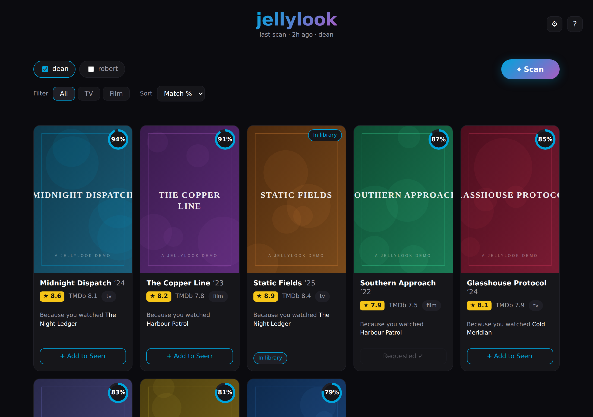
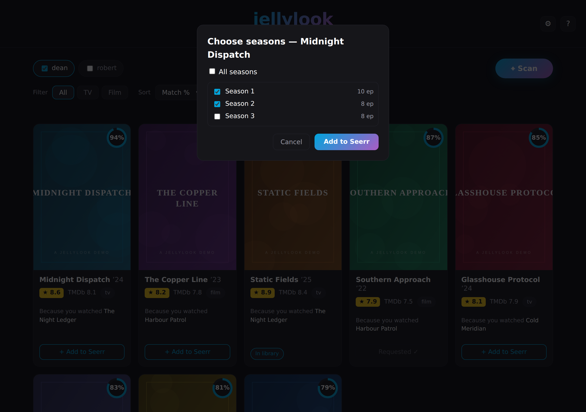
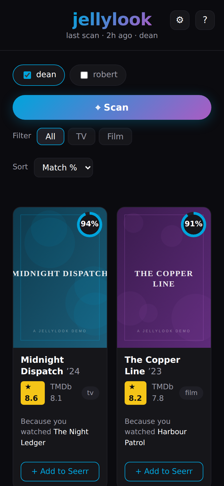

<div align="center">


**Self-hosted "what to watch next" for Jellyfin — and Plex.**

One AI call. Sixty recommendations. Zero subscriptions.

[](LICENSE)
[](https://www.python.org/)
[](docker-compose.yml)
[](https://fastapi.tiangolo.com/)



</div>

---

jellylook reads your **recent watch history** from [Jellystat](https://github.com/CyferShepard/Jellystat) (Jellyfin) or [Tautulli](https://github.com/Tautulli/Tautulli) (Plex), asks an AI provider — **one call per scan** — for a batch of similar titles, enriches them with **IMDB (OMDb) + TMDb** ratings and artwork, and shows them as poster cards with a match %, a "Because you watched…" line, and a one-click **Add to Seerr** (Overseerr/Jellyseerr) button.

Dark-only, Jellyfin palette. Sort, filter, 20 cards per page. Results are kept for 60 days, then purged automatically.

> The screenshots on this page use fictional demo titles and generated artwork — your instance shows real posters from TMDb.

## Features

- **Pick your AI** — Anthropic (Claude), OpenAI, Google AI (Gemini), Open WebUI, or Ollama. Switch with one line in `.env`; run fully local with Ollama if you like.
- **One AI call per scan** returns the whole batch (default 60). Sorting, filtering, paging and Seerr requests never trigger another call.
- **Match %** and **"Because you watched \<seed\>"** on every card, so you can see why each title was suggested.
- **★ IMDB rating** (via OMDb) and TMDb score on every card, with posters and backdrops from TMDb.
- **Add to Seerr** — movies request in one click, TV opens a season picker. Titles you already own show an "In library" chip instead.
- **Jellystat (or Tautulli) is the taste signal**; Jellyfin is used only for the ownership check and as a fallback history source. On a Plex setup, Tautulli covers users, history and the ownership check by itself — no Jellyfin needed.
- SQLite storage, metadata cache (keeps you under OMDb's 1,000/day free limit — today's usage shows in Settings), automatic 60-day purge.
- Single container: FastAPI + vanilla HTML/CSS/JS. No database server, no build step, no telemetry.

## Screenshots

| Season picker | Mobile |
|:---:|:---:|
|  |  |

## Requirements

- **Docker** with Docker Compose (any recent version — the compose file uses the modern format).
- One of:
  - a running **Jellyfin** server and a **Jellystat** instance pointed at it, **or**
  - a running **Plex** server and a **Tautulli** instance pointed at it.
- **Overseerr or Jellyseerr** if you want the Add-to-Seerr button (optional — cards still render without it).
- Free API keys for **TMDb** and **OMDb**, plus a key for whichever AI provider you choose (or a local Ollama, which needs none).

## Installation

### 1. Get the code

```bash
git clone https://github.com/<your-username>/jellylook.git
cd jellylook
```

### 2. Create your `.env`

```bash
cp .env.example .env
```

Open `.env` in an editor and fill in the keys below. Everything else can stay at its default.

**Jellyfin + Jellystat** (default — `HISTORY_SOURCE=jellystat`):

| Key | Where to get it |
|---|---|
| `JELLYSTAT_API_KEY` | Jellystat → Settings → API Keys |
| `JELLYFIN_API_KEY` | Jellyfin → Dashboard → API Keys |

**Plex + Tautulli** (set `HISTORY_SOURCE=tautulli`, un-hash the Tautulli block and hash out (`#`) the Jellystat/Jellyfin lines instead):

| Key | Where to get it |
|---|---|
| `TAUTULLI_API_KEY` | Tautulli → Settings → Web Interface → API key |

**Both stacks also need:**

| Key | Where to get it |
|---|---|
| `SEERR_API_KEY` | Overseerr/Jellyseerr → Settings → General |
| `TMDB_API_KEY` | [themoviedb.org](https://www.themoviedb.org/settings/api) — free v3 key |
| `OMDB_API_KEY` | [omdbapi.com](https://www.omdbapi.com/apikey.aspx) — free, 1,000 lookups/day |
| one AI key | see the provider table below |

Also update `JELLYSTAT_URL` + `JELLYFIN_URL` (or `TAUTULLI_URL`) and `SEERR_URL` to match your network. **Use LAN IPs, not `localhost`** — these URLs must be reachable *from inside the container*.

### 3. Choose an AI provider

Set `LLM_PROVIDER` and `LLM_MODEL`, plus the matching key:

| `LLM_PROVIDER` | Needs | Example `LLM_MODEL` |
|---|---|---|
| `anthropic` | `ANTHROPIC_API_KEY` | `claude-haiku-4-5` |
| `openai` | `OPENAI_API_KEY` (+ optional `OPENAI_BASE_URL`) | `gpt-4o-mini` |
| `google` | `GOOGLE_API_KEY` | `gemini-2.0-flash` |
| `openwebui` | `OPENWEBUI_API_KEY` + `OPENWEBUI_BASE_URL` | whatever your instance serves |
| `ollama` | `OLLAMA_BASE_URL` only — no key | `qwen3:14b` |

Open WebUI uses its OpenAI-compatible endpoint (`{OPENWEBUI_BASE_URL}/api/chat/completions`) — create an API key under your Open WebUI account settings.

### 4. Build and start

```bash
docker compose up --build -d
```

jellylook fails fast on missing configuration and prints exactly which `.env` variables it still needs — if the container exits immediately, run `docker compose logs jellylook` and it will tell you what to fix.

### 5. Open it

Go to `http://<your-host>:3045`, tick who's watching, and press **Scan**. The first scan takes a minute or so (one AI call plus metadata lookups for ~60 titles); everything after that — sorting, filtering, paging, Seerr requests — is instant and free.

### Verifying the install (optional)

With a filled `.env`:

```bash
docker compose run --rm jellylook python -m app.selftest
```

This enriches a known title through TMDb + OMDb, proves the cache works, and asks your active AI provider for 5 sample recommendations.

## Configuration reference

Secrets live in `.env`. Day-to-day preferences (default users, batch size, TV request mode, default sort/filter) are edited in the app's **Settings** panel and stored in SQLite — no restart needed for those.

| `.env` variable | Default | What it does |
|---|---|---|
| `JELLYLOOK_PORT` | `3045` | Host port the UI is served on |
| `HISTORY_SOURCE` | `jellystat` | `jellystat` (Jellyfin), `tautulli` (Plex) or `jellyfin` |
| `RECS_PER_SCAN` | `60` | Titles requested per scan |
| `PER_PAGE` | `20` | Cards per page |
| `RETENTION_DAYS` | `60` | How long results and cache are kept before purge |
| `LLM_TEMPERATURE` | `0.7` | Creativity of the AI suggestions |
| `LOG_LEVEL` | `INFO` | Container log verbosity |

Restart the container after changing `.env`: `docker compose up -d --force-recreate`.

## How a scan works

1. Recent plays for the selected user(s) are pulled from Jellystat (Jellyfin fallback) — or from Tautulli on a Plex setup — and weighted by recency and play count.
2. One request to your AI provider returns the whole batch as JSON — title, year, type, a one-line reason, a 0–100 match estimate, and the watched title it's based on.
3. Each suggestion is resolved via TMDb (id, poster, backdrop, score) and OMDb (IMDB rating), with every lookup cached.
4. Titles already in your library are flagged (Jellyfin matches on IMDb/TMDb ids; Plex matches on title + year via Tautulli); anything you've already watched is dropped.
5. Results land in SQLite and render 20 per page.

The match % is the model's own similarity estimate — directionally useful, not science.

## Troubleshooting

- **Container exits at startup** — jellylook fails fast on missing config and prints exactly which `.env` variables it needs. Check `docker compose logs jellylook`.
- **No users / scan fails immediately** — the history source (Jellystat, Tautulli or Jellyfin) is unreachable or the API key is wrong. The URLs must be reachable *from inside the container* (use LAN IPs, not `localhost`).
- **Add to Seerr disabled** — Seerr didn't answer; cards still work and the button returns when Seerr does.
- **OMDb limit** — the free key allows 1,000 lookups/day. The cache makes re-scans nearly free; Settings shows today's count.

## Security

jellylook has **no built-in authentication** — it is designed to run on a trusted home LAN. Anyone who can reach the port can trigger scans (which spend your AI provider credits), change app settings, and file Overseerr/Jellyseerr requests.

- **Do not expose the port directly to the internet.** If you want remote access, put it behind a VPN (WireGuard, Tailscale) or a reverse proxy with authentication (e.g. Nginx Proxy Manager, Authelia, Caddy with basic auth).
- To restrict it to the Docker host only, bind the port to localhost in `docker-compose.yml`: `"127.0.0.1:3045:8000"`.
- Keep your real `.env` out of version control — it holds all your API keys. The repo's `.gitignore` already excludes it; never force-add it.

## Privacy

jellylook sends your recent watch **titles** (not full history, not identities) to whichever AI provider you configure, and title lookups to TMDb and OMDb. If you'd rather nothing leaves your network, point `LLM_PROVIDER=ollama` at a local model — then only the TMDb/OMDb metadata lookups go out.

## Stack

Python 3.12 · FastAPI · httpx · SQLite (WAL) · vanilla HTML/CSS/JS · one Docker container.

## License

[MIT](LICENSE) — do what you like, no warranty. Not affiliated with Jellyfin, Jellystat, Plex, Tautulli, Overseerr/Jellyseerr, TMDb, OMDb, or any AI provider. This product uses the TMDB API but is not endorsed or certified by TMDB.
